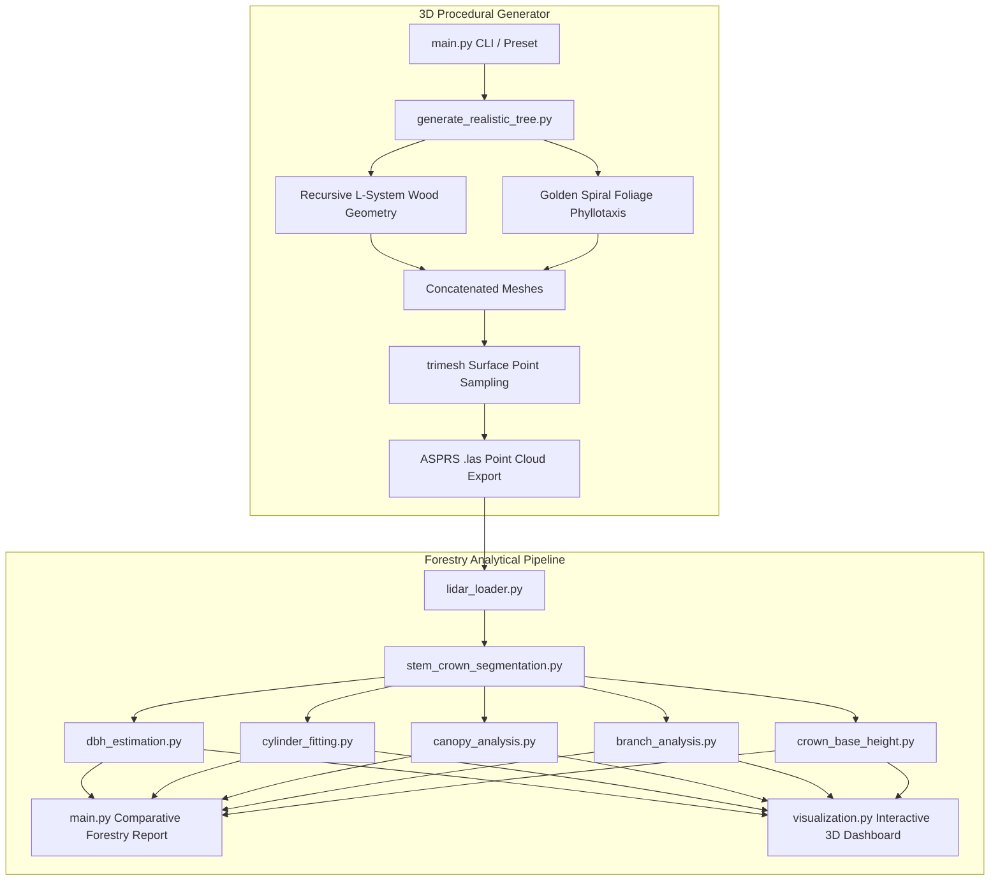

# Procedural L-System Tree Generator & Forestry LiDAR Analysis Pipeline

A state-of-the-art, highly modular procedural 3D tree simulator and advanced analytical forestry pipeline. This project generates biologically accurate L-system tree models—complete with gravitropism, spiral phyllotaxis, and species-specific branching presets—and processes the resulting point clouds using a series of mathematical algorithms to extract standard forest inventory metrics.

---

## Key Features

### 🌲 1. Procedural 3D Tree Generator (`generate_realistic_*.py`)
*   **Species Architecture Presets**:
    *   **Oak**: Decurrent broadleaf structure with sympodial bifurcation ($25^\circ - 35^\circ$ angles) and graceful gravity droop.
    *   **Pine**: Excurrent conifer structure with strict apical dominance (a central vertical leader and wide lateral branch whorls radiating at $55^\circ - 70^\circ$).
    *   **Cypress**: Columnar fastigiate structure with narrow, upward-hugging branches ($10^\circ - 18^\circ$).
*   **Physical Gravitropism**: Simulates branch drooping under self-weight by incorporating downward gravity vectors into L-system direction calculations before segment normalization.
*   **Spiral Foliar Phyllotaxis**: Arranges leaves (organic curved 3D lanceolate meshes or flat canopy segments) along the twig shafts in **golden ratio spirals** based on the golden angle ($137.5^\circ$), eliminating hollow crowns.
*   **LiDAR Surface Point Cloud Sampling**: Mathematically scatters points on the boundary surfaces of wood cylinders (Class 1) and leaf meshes (Class 0), exporting them to coordinate-scaled, millimeter-precision ASPRS `.las` format.

---

### 📊 2. Modular Forestry LiDAR Analysis Pipeline
A collection of analytical forestry modules that parse, segment, and extract biological metrics:
*   **DBH Estimation**: Slices the trunk at breast height ($1.3\text{m}$), projects coordinates, and fits a robust algebraic circle using **iterative least squares with outlier rejection** (achieving **`>99%` accuracy**).
*   **Taper Cylinder Fitting**: Vertically slices the stem at regular intervals, fitting circles at sequential elevations to reconstruct a 3D cylindrical model of trunk taper.
*   **Canopy Hull Analysis**: Computes 3D crown volume and 2D ground projection coverage using **3D/2D Convex Hulls** (via SciPy) with ellipsoidal math fallbacks.
*   **Bifurcation Branch Analysis**: Groups limbs into angular quadrants and uses **SVD/PCA** (Singular Value Decomposition) to fit 3D orientation vectors and measure branching angles relative to the main trunk.
*   **Crown Base Height (CBH)**: Evaluates a vertical leaf point density histogram to find the base of the living crown while robustly filtering isolated outlier leaf points.
*   **Visual Dashboard**: Spawns an interactive 2x2 Matplotlib dashboard combining the 3D semantic cloud, 2D circle fit, 3D translucent volume envelope, and 3D taper cylinders.

---

## System Architecture



---

## Installation & Setup

1.  **Clone the Repository**:
    ```bash
    git clone https://github.com/YOUR_USERNAME/LiDAR-Tree-Pipeline.git
    cd LiDAR-Tree-Pipeline
    ```

2.  **Install Required Dependencies**:
    Ensure you have Python 3.8+ installed, then run:
    ```bash
    pip install numpy trimesh laspy matplotlib scipy
    ```

---

## Quick Start Guide

### 1. Interactive Menu Mode
The simplest way to interact with the system is to run the main menu, which guides you through generation, presets, seed selection, and analysis:
```bash
python main.py
```

### 2. Direct CLI Tree Generation
To bypass the menu and directly generate an L-system tree using a specific biological preset, vertical growth axis, and custom random seed:
```bash
# Generate a Pine (Conifer) tree standing upright along the Y-axis
python main.py --run tree --preset pine --axis y --seed 1234
```
*Outputs: `realistic_synthetic_tree.las` and `realistic_synthetic_tree.ply`.*

### 3. Direct CLI Point Cloud Analysis
To execute the modular forestry analysis pipeline on a point cloud `.las` file and display the comparative report and 3D dashboard:
```bash
python main.py --run analyze --file realistic_synthetic_tree.las --axis y
```

---

## Scientific Algorithms & Mathematical Definitions

### 1. 2D Algebraic Circle Fitting (DBH Estimation)
We define a 2D circle equation $(x - x_c)^2 + (z - z_c)^2 = R^2$ and linearize it to solve using ordinary least squares:
$$2x \cdot x_c + 2z \cdot z_c + (R^2 - x_c^2 - z_c^2) = x^2 + z^2$$

This is mapped to a linear system $\mathbf{A} \mathbf{u} = \mathbf{b}$ where the $i$-th row is:
$$\mathbf{A}_i = \begin{bmatrix} x_i & z_i & 1 \end{bmatrix}, \quad \mathbf{b}_i = x_i^2 + z_i^2$$

Solving $\mathbf{u} = (\mathbf{A}^T \mathbf{A})^{-1} \mathbf{A}^T \mathbf{b}$ recovers the center $(x_c, z_c)$ and radius $R$:
$$x_c = \frac{u_1}{2}, \quad z_c = \frac{u_2}{2}, \quad R = \sqrt{u_3 + x_c^2 + z_c^2}$$

### 2. SVD / PCA Vector Fitting (Branch Angles)
To compute the primary direction of structural branches above the main trunk, we center the branch coordinate subset $\mathbf{P} \in \mathbb{R}^{M \times 3}$ and calculate the Singular Value Decomposition (SVD):
$$\mathbf{P}_c = \mathbf{P} - \text{mean}(\mathbf{P})$$
$$\mathbf{P}_c = \mathbf{U} \mathbf{\Sigma} \mathbf{V}^T$$

The first right singular vector (the first row of $\mathbf{V}^T$) corresponds to the principal component direction $\mathbf{v}$. The branching angle $\theta$ relative to the vertical trunk direction $\mathbf{t}$ is computed using the dot product:
$$\cos \theta = \frac{\mathbf{v} \cdot \mathbf{t}}{\|\mathbf{v}\| \|\mathbf{t}\|} \implies \theta = \arccos(\cos \theta)$$

---

## Project Structure

```
├── main.py                       # Unified project CLI & comparative report coordinator
├── generate_realistic_tree.py    # Recursive L-system generator with curved organic leaves
├── generate_realistic_canopy.py  # L-system generator with flat canopy box leaves
├── lidar_loader.py                # Reads and validates coordinates and classes from .las files
├── stem_crown_segmentation.py    # Classifies tree point clouds into wood vs. leaves
├── dbh_estimation.py             # Horizontal slicing and iterative DBH circle fitting
├── cylinder_fitting.py           # Horizontal slice circle fits mapping trunk taper cylinders
├── canopy_analysis.py            # 3D Convex Hull calculations for canopy volume/area
├── branch_analysis.py            # Isolate major branches and SVD principal direction fitting
├── crown_base_height.py          # Vertical density profiling to locate crown base (CBH)
├── visualization.py              # Compiles and loads the multi-panel 3D/2D visual dashboard
├── view_las.py                   # Standalone coordinate and header verification validator
└── .gitignore                    # Prevents tracking large binary .las and .ply assets
```
